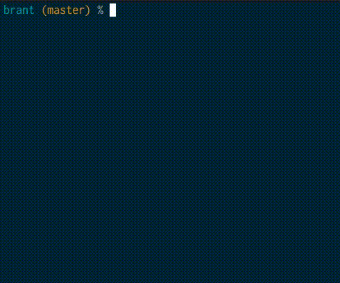
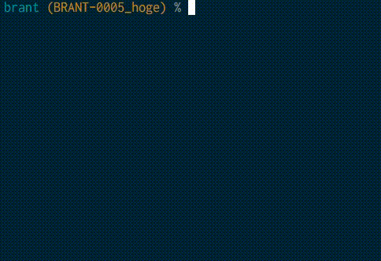

# brant : Seamless Jira ticket and git branch
[](https://github.com/ap8322/brant/blob/master/LICENSE)

:construction: This tool is under development.

# Features
- Create Topic branch which prefix is ticket id you search incrementally and selected in terminal.
- Check ticket information linked to the current branch speedily.
- You don't need to opening browser and finding target ticket to remember the ticket id.

# Support
- Issue tracking tool
    - [x] Jira Cloud

# Usage
```
brant - Ticket driven development support command-line minimal tool.

Usage:
  brant [command]

Available Commands:
  conf        Edit config file
  create      Create ticket ID prefix branch
  fetch       Fetch ticket list and cache them
  help        Help about any command
  info        Print ticket information linked to the current branch
  open        Open ticket url you selected

Flags:
  -h, --help   help for brant

Use "brant [command] --help" for more information about a command.
```

## Before Setting
To use this tool, you should set JIRA settings(JIRA host, your JIRA account information,JQL).  
`brant conf` command can edit config file.

## Fetch Jira Ticket List
`brant fetch` command can fetch ticket list and cache them. 
You can filter fetch tickets by [JIRA Query Language(JQL)](https://confluence.atlassian.com/jiracore/blog/2015/07/search-jira-like-a-boss-with-jql) to set config.


## Create Topic Branch
`brant create` command can create ticket ID prefix branch.  
Before you create topic branch, you can search and select tickets incrementally from cache.  
you can select filtering tool (peco,fzf etc) to set config. (default: [fzf](https://github.com/junegunn/fzf))




### Check ticket information
`brant info` command can check ticket information linked to the current branch.  
this command prints ticket title and link.




## Build

```
$ mkdir -p $GOPATH/src/github.com/ap8322
$ cd $GOPATH/src/github.com/ap8322
$ git clone https://github.com/ap8322/brant.git
$ cd brant
$ dep ensure # if not install dep, run `go get -u github.com/golang/dep/cmd/dep`
$ go install
```

---

# License
MIT

# Author
Yuki Haneda
